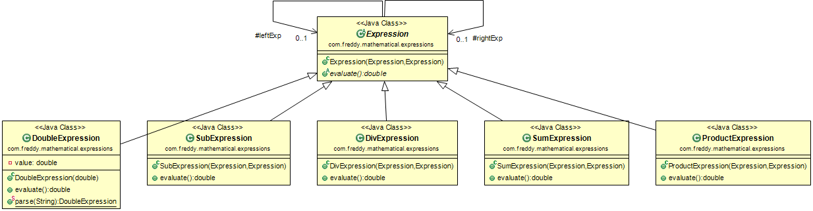

# Simple Mathematical Expression

This is a basic example of how to use interpreter design pattern to implement a simple mathematical operation!!

You have a simple [Test](src/test/java/com/freddy/mathematical/expressions/ExpressionTest.java) with an example of **3+3-2*2/2**

## Class Diagram which represents the Interpreter Pattern

